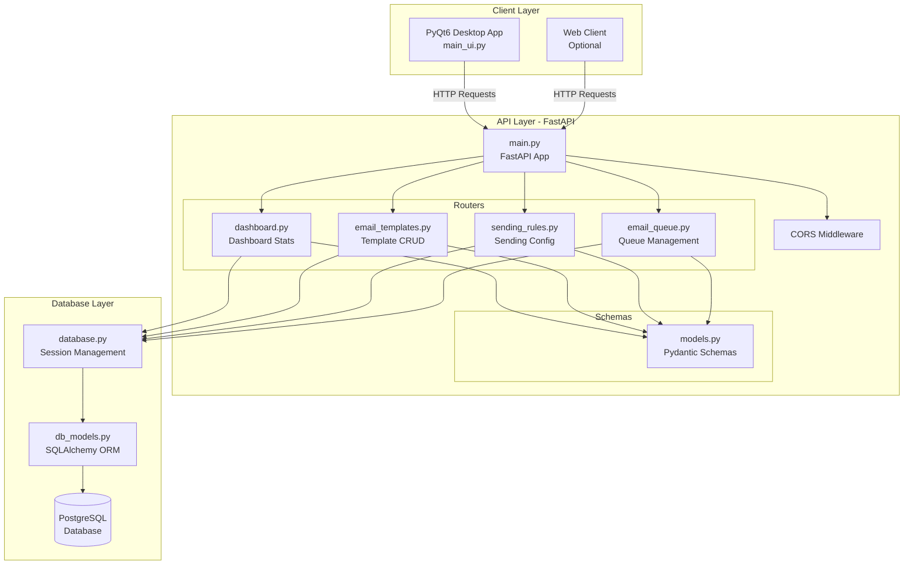
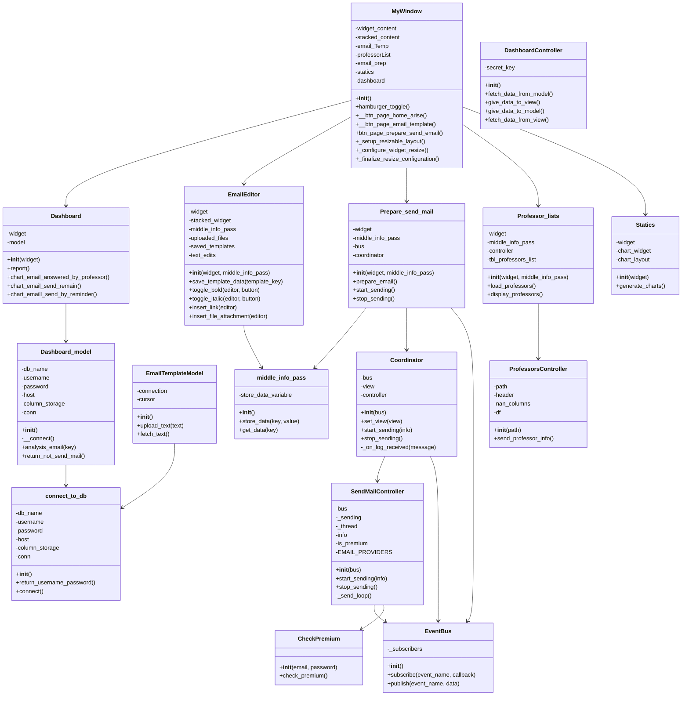
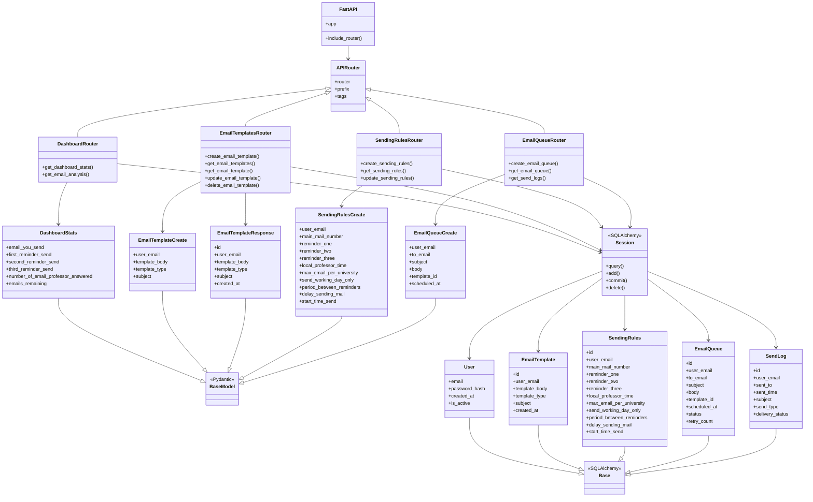
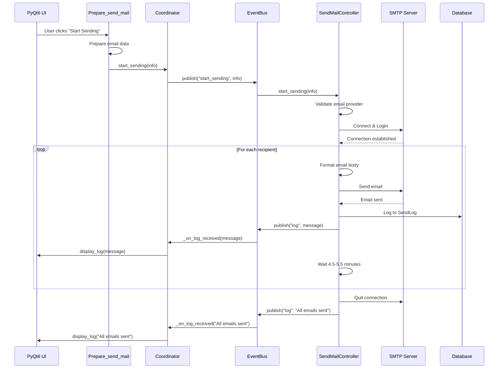
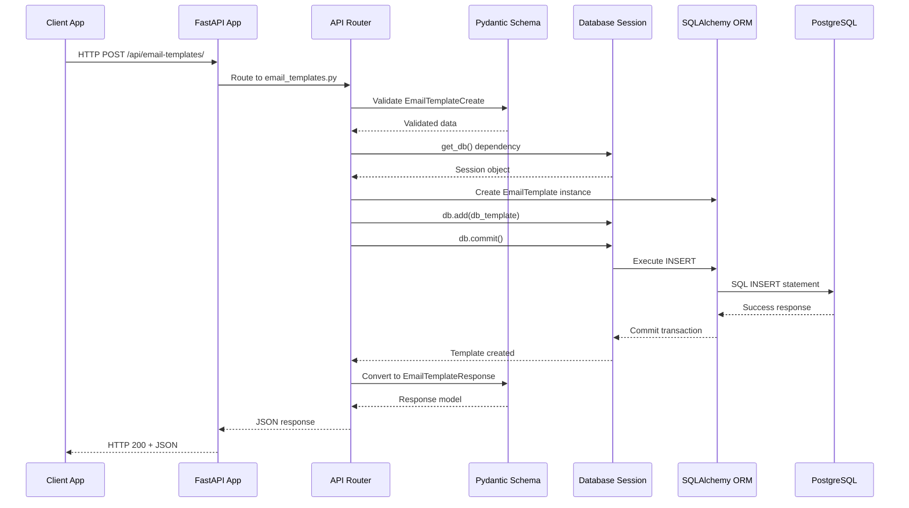
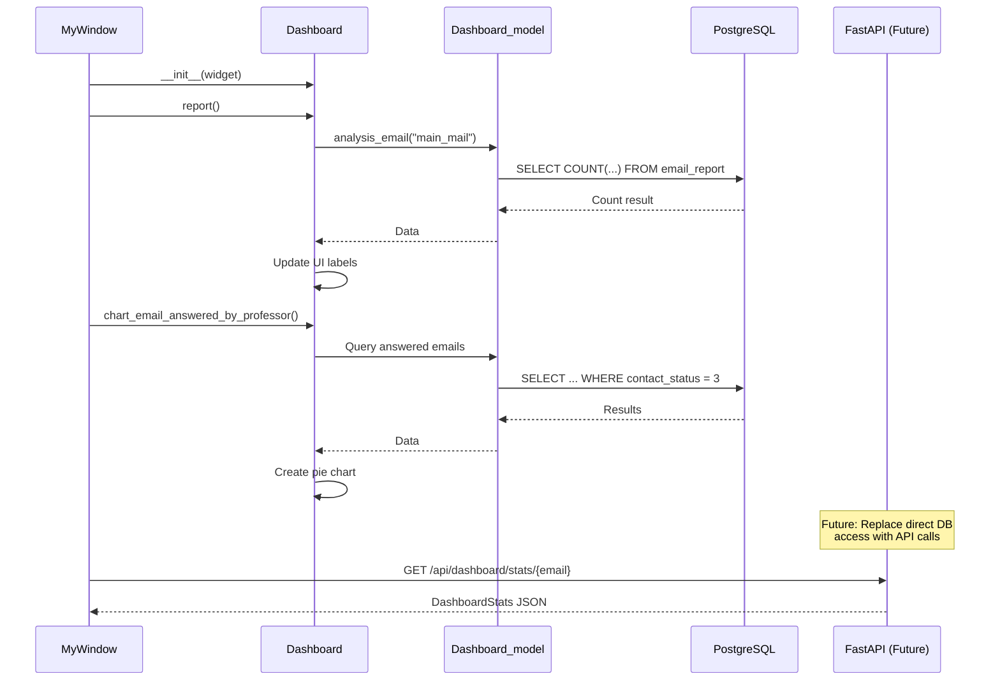
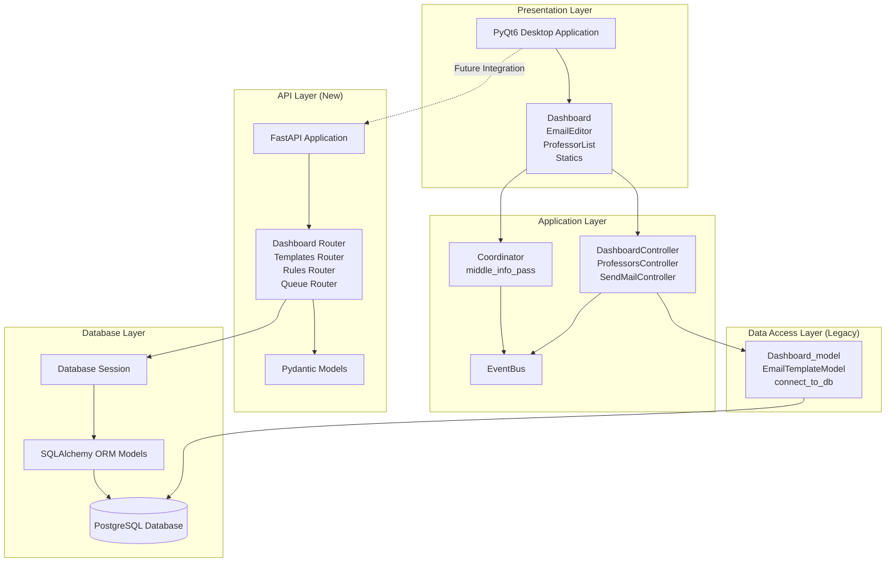

# ApplyChe UML Documentation

This document provides comprehensive UML diagrams for the ApplyChe project, including database schema, API architecture, class structures, and workflow sequences.

## Table of Contents

1. [Database ER Diagram](#database-er-diagram)
2. [API Architecture Diagram](#api-architecture-diagram)
3. [Class Diagrams](#class-diagrams)
4. [Sequence Diagrams](#sequence-diagrams)
5. [Component Diagram](#component-diagram)

---

## Database ER Diagram

### Entity Relationship Diagram (Mermaid)

```mermaid
erDiagram
    USERS ||--o{ USER_EDUCATION_INFORMATION : has
    USERS ||--o{ SUBSCRIPTIONS : has
    USERS ||--o{ SUBSCRIPTION_HISTORY : has
    USERS ||--o{ EMAIL_TEMPLATES : creates
    USERS ||--o{ SENDING_RULES : configures
    USERS ||--o{ EMAIL_QUEUE : queues
    USERS ||--o{ SEND_LOG : logs
    USERS ||--o{ PROFESSOR_CONTACT : tracks
    USERS ||--o{ SAVED_POSITIONS : saves
    USERS ||--o{ PROFESSOR_REVIEW : writes
    USERS ||--o{ COMMENT : writes
    USERS ||--o{ CHAT_LOG : generates
    USERS ||--o{ API_TOKEN : uses
    USERS ||--o{ METRIC : tracks
    USERS ||--o{ PROFESSOR_LIST : uploads
    USERS ||--o{ EMAIL_PROPERTY : configures
    USERS ||--o{ FILE : owns

    UNIVERSITIES ||--o{ DEPARTMENTS : contains
    UNIVERSITIES ||--o{ USER_EDUCATION_INFORMATION : referenced_by
    UNIVERSITIES ||--o{ PROFESSORS : hosts
    UNIVERSITIES ||--o{ OPEN_POSITIONS : offers

    DEPARTMENTS ||--o{ PROFESSORS : contains
    DEPARTMENTS ||--o{ OPEN_POSITIONS : offers

    PROFESSORS ||--o{ PROFESSOR_RESEARCH_INTERESTS : has
    PROFESSORS ||--o{ OPEN_POSITIONS : supervises
    PROFESSORS ||--o{ PROFESSOR_CONTACT : contacted_by
    PROFESSORS ||--o{ PROFESSOR_REVIEW : reviewed

    EMAIL_TEMPLATES ||--o{ TEMPLATE_FILES : contains
    EMAIL_TEMPLATES ||--o{ EMAIL_QUEUE : used_in

    OPEN_POSITIONS ||--o{ PROFESSOR_CONTACT : referenced_in
    OPEN_POSITIONS ||--o{ SAVED_POSITIONS : saved_in

    PROFESSOR_REVIEW ||--o{ COMMENT : has
    PROFESSOR_REVIEW ||--o{ REVIEW_VOTE : receives
    COMMENT ||--o{ COMMENT_VOTE : receives

    USERS {
        CITEXT email PK
        TEXT password_hash
        TEXT password_salt
        TIMESTAMP created_at
        TIMESTAMP last_login
        SMALLINT failed_login_attempts
        BOOLEAN is_active
        TEXT display_name
        TEXT profile_image
        TEXT personal_website
        CITEXT backup_email
    }

    USER_EDUCATION_INFORMATION {
        INT id PK
        CITEXT user_email FK
        TEXT major
        INT university_id FK
        TEXT university_department
        STRING education_level
        NUMERIC grade
        NUMERIC ielts
        NUMERIC gre
        TEXT google_scholar_link
        TEXT CV_path
        TEXT SOP_path
        TIMESTAMP created_at
    }

    UNIVERSITIES {
        INT id PK
        TEXT name
        CHAR country
        TEXT website
    }

    DEPARTMENTS {
        INT id PK
        INT university_id FK
        TEXT university_deparment_name
    }

    PROFESSORS {
        CITEXT email PK
        TEXT name
        TEXT major
        INT university_id FK
        INT department_id FK
        TEXT professor_img
        JSONB meta_data
    }

    PROFESSOR_RESEARCH_INTERESTS {
        INT id PK
        CITEXT professor_email FK
        TEXT interest
    }

    OPEN_POSITIONS {
        BIGINT id PK
        INT university_id FK
        INT department_id FK
        TEXT position_title
        TEXT fund
        NUMERIC min_ielts
        NUMERIC min_gre
        CITEXT contact_email
        JSONB requirements
        CITEXT supervisor_email FK
        DATE deadline
        TEXT description
        TEXT more_info_link
        SMALLINT graduate_level
        JSONB meta_data
        TEXT country
    }

    PROFESSOR_CONTACT {
        INT id PK
        CITEXT user_email FK
        CITEXT professor_email FK
        BIGINT position_id FK
        TIMESTAMP last_contact_time
        TIMESTAMP next_contact_time
        SMALLINT contact_status
        BOOLEAN is_active
        SMALLINT attempts
    }

    SAVED_POSITIONS {
        INT id PK
        CITEXT user_email FK
        BIGINT position_id FK
        SMALLINT status
        TEXT notes
        TIMESTAMP created_at
    }

    EMAIL_TEMPLATES {
        INT id PK
        CITEXT user_email FK
        TEXT template_body
        SMALLINT template_type
        TEXT subject
        TIMESTAMP created_at
    }

    TEMPLATE_FILES {
        INT id PK
        INT email_template_id FK
        TEXT file_path
    }

    SENDING_RULES {
        INT id PK
        CITEXT user_email FK
        SMALLINT main_mail_number
        SMALLINT reminder_one
        SMALLINT reminder_two
        SMALLINT reminder_three
        BOOLEAN local_professor_time
        SMALLINT max_email_per_university
        BOOLEAN send_working_day_only
        SMALLINT period_between_reminders
        SMALLINT delay_sending_mail
        TIME start_time_send
        TIMESTAMP created_at
    }

    EMAIL_QUEUE {
        INT id PK
        CITEXT user_email FK
        CITEXT to_email
        TEXT subject
        TEXT body
        INT template_id FK
        TIMESTAMP scheduled_at
        SMALLINT status
        SMALLINT retry_count
        TIMESTAMP created_at
    }

    SEND_LOG {
        INT id PK
        CITEXT user_email FK
        CITEXT sent_to
        TIMESTAMP sent_time
        TEXT subject
        SMALLINT send_type
        SMALLINT delivery_status
    }

    SUBSCRIPTIONS {
        INT id PK
        CITEXT user_email FK
        VARCHAR plan_name
        TIMESTAMP started_at
        TIMESTAMP expires_at
        SMALLINT status
    }

    SUBSCRIPTION_HISTORY {
        INT id PK
        CITEXT user_email FK
        VARCHAR plan_name
        TIMESTAMP started_at
        TIMESTAMP ended_at
        TEXT payment_reference
        SMALLINT status
        TIMESTAMP created_at
    }

    PROFESSOR_REVIEW {
        INT id PK
        CITEXT user_email FK
        CITEXT professor_email FK
        TEXT review_text
        NUMERIC rating
        TIMESTAMP created_at
        TIMESTAMP updated_at
    }

    COMMENT {
        INT id PK
        INT review_id FK
        CITEXT commenter_email FK
        TEXT comment_text
        TIMESTAMP created_at
    }

    REVIEW_VOTE {
        INT id PK
        INT review_id FK
        CITEXT voter_email FK
        SMALLINT vote_type
        TIMESTAMP created_at
    }

    COMMENT_VOTE {
        INT id PK
        INT comment_id FK
        CITEXT voter_email FK
        SMALLINT vote_type
        TIMESTAMP created_at
    }

    CHAT_LOG {
        INT id PK
        CITEXT user_email FK
        TEXT user_message
        TEXT bot_response
        TIMESTAMP created_at
    }

    API_TOKEN {
        INT id PK
        CITEXT user_email FK
        TEXT token_hash
        TIMESTAMP expires_at
        TIMESTAMP created_at
    }

    METRIC {
        INT id PK
        CITEXT user_email FK
        TEXT metric_name
        NUMERIC metric_value
        TIMESTAMP recorded_at
    }

    PROFESSOR_LIST {
        INT id PK
        CITEXT user_email FK
        TEXT file_path
        TIMESTAMP uploaded_at
    }

    EMAIL_PROPERTY {
        INT id PK
        CITEXT user_email FK
        TEXT property_key
        TEXT property_value
        TIMESTAMP updated_at
    }

    FILE {
        INT id PK
        CITEXT owner_email FK
        TEXT file_path
        TEXT file_type
        BIGINT file_size
        TIMESTAMP uploaded_at
    }
```



---

## API Architecture Diagram

### FastAPI Application Structure (Mermaid)



### API Component Diagram (PlantUML)

```plantuml
@startuml API Architecture
package "FastAPI Application" {
    [main.py] as Main
    [CORS Middleware] as CORS
}

package "API Routes" {
    [dashboard.py] as Dashboard
    [email_templates.py] as Templates
    [sending_rules.py] as Rules
    [email_queue.py] as Queue
}

package "Schemas" {
    [models.py] as Schemas
}

package "Database" {
    [database.py] as DB
    [db_models.py] as ORM
    database PostgreSQL
}

Main --> CORS
Main --> Dashboard
Main --> Templates
Main --> Rules
Main --> Queue

Dashboard --> Schemas
Templates --> Schemas
Rules --> Schemas
Queue --> Schemas

Dashboard --> DB
Templates --> DB
Rules --> DB
Queue --> DB

DB --> ORM
ORM --> PostgreSQL
@enduml
```

---

## Class Diagrams

### Existing Code Structure (Mermaid)



### API Class Diagram (Mermaid)



---

## Sequence Diagrams

### Email Sending Workflow (Mermaid)



### API Request Flow (Mermaid)



### Dashboard Data Loading (Mermaid)



---

## Component Diagram

### System Architecture (Mermaid)



### Detailed Component Diagram (PlantUML)

```plantuml
@startuml Component Diagram
package "Presentation" {
    [PyQt6 Main Window] as MainUI
    [Dashboard View] as DashView
    [Email Editor] as EmailView
    [Professor List] as ProfView
    [Statistics View] as StatsView
}

package "Application Logic" {
    [Dashboard Controller] as DashCtrl
    [Professors Controller] as ProfCtrl
    [Send Mail Controller] as MailCtrl
    [Email Template Controller] as TempCtrl
}

package "Middleware" {
    [Coordinator] as Coord
    [Event Bus] as Bus
    [Info Pass] as Info
}

package "Data Models (Legacy)" {
    [Dashboard Model] as DashModel
    [Email Template Model] as TempModel
    [Database Connection] as DBConn
}

package "API Layer" {
    [FastAPI Main] as FastAPI
    [Dashboard Router] as DashRouter
    [Templates Router] as TempRouter
    [Rules Router] as RulesRouter
    [Queue Router] as QueueRouter
}

package "Schemas" {
    [Pydantic Models] as Schemas
}

package "Database" {
    [SQLAlchemy ORM] as ORM
    [PostgreSQL] as DB
}

MainUI --> DashView
MainUI --> EmailView
MainUI --> ProfView
MainUI --> StatsView

DashView --> DashCtrl
EmailView --> TempCtrl
ProfView --> ProfCtrl
EmailView --> MailCtrl

DashCtrl --> DashModel
TempCtrl --> TempModel
MailCtrl --> Coord
MailCtrl --> Bus

Coord --> Bus
Coord --> MailCtrl

DashModel --> DBConn
TempModel --> DBConn
DBConn --> DB

DashView -.-> DashRouter : Future
EmailView -.-> TempRouter : Future

FastAPI --> DashRouter
FastAPI --> TempRouter
FastAPI --> RulesRouter
FastAPI --> QueueRouter

DashRouter --> Schemas
TempRouter --> Schemas
RulesRouter --> Schemas
QueueRouter --> Schemas

DashRouter --> ORM
TempRouter --> ORM
RulesRouter --> ORM
QueueRouter --> ORM

ORM --> DB
@enduml
```

---

## Database Schema Details

### Core Tables

1. **users** - User accounts and authentication
2. **user_education_information** - Education details per user
3. **universities** - University master data
4. **departments** - Department master data
5. **professors** - Professor profiles
6. **professor_research_interests** - Research interests (many-to-many)
7. **open_positions** - Available positions/opportunities

### Email System Tables

8. **email_templates** - Email template storage
9. **template_files** - Files attached to templates
10. **sending_rules** - Email sending configuration
11. **email_queue** - Queue for scheduled emails
12. **send_log** - History of sent emails
13. **professor_contact** - Contact tracking

### Subscription Tables

14. **subscriptions** - Active subscriptions
15. **subscription_history** - Subscription history

### Review & Social Tables

16. **professor_review** - Reviews of professors
17. **comment** - Comments on reviews
18. **review_vote** - Votes on reviews
19. **comment_vote** - Votes on comments

### Utility Tables

20. **saved_positions** - User bookmarks
21. **chat_log** - Chatbot logs
22. **api_token** - API authentication tokens
23. **metric** - User metrics
24. **professor_list** - Uploaded professor lists
25. **email_property** - Email account properties
26. **file** - File registry

---

## API Endpoints Summary

### Dashboard Endpoints
- `GET /api/dashboard/stats/{user_email}` - Get dashboard statistics
- `GET /api/dashboard/email-analysis/{user_email}` - Get email analysis by type

### Email Templates Endpoints
- `POST /api/email-templates/` - Create template
- `GET /api/email-templates/{user_email}` - Get all templates
- `GET /api/email-templates/{user_email}/{template_id}` - Get specific template
- `PUT /api/email-templates/{template_id}` - Update template
- `DELETE /api/email-templates/{template_id}` - Delete template

### Sending Rules Endpoints
- `POST /api/sending-rules/` - Create rules
- `GET /api/sending-rules/{user_email}` - Get rules
- `PUT /api/sending-rules/{rules_id}` - Update rules

### Email Queue Endpoints
- `POST /api/email-queue/` - Add to queue
- `GET /api/email-queue/{user_email}` - Get queue items
- `GET /api/email-queue/send-logs/{user_email}` - Get send logs

---

## Notes

1. **Legacy Code**: The existing PyQt6 application uses direct database connections via `psycopg`. The FastAPI layer provides a modern REST API alternative.

2. **Future Migration**: The UI components can gradually migrate from direct database access to API calls.

3. **Event-Driven Architecture**: The email sending system uses an event bus pattern for decoupled communication.

4. **ORM Benefits**: SQLAlchemy ORM provides type safety, relationship management, and easier maintenance compared to raw SQL.

5. **API Documentation**: FastAPI automatically generates OpenAPI/Swagger documentation at `/docs` endpoint.

---

## Diagram Tools

- **Mermaid**: Supported by GitHub, GitLab, and many markdown viewers
- **PlantUML**: Requires PlantUML plugin or online viewer (http://www.plantuml.com/plantuml/uml/)

To view PlantUML diagrams, use:
- VS Code: Install "PlantUML" extension
- Online: http://www.plantuml.com/plantuml/uml/
- Local: Install PlantUML Java application

---

**Last Updated**: 2025-01-16
**Version**: 1.0.0

